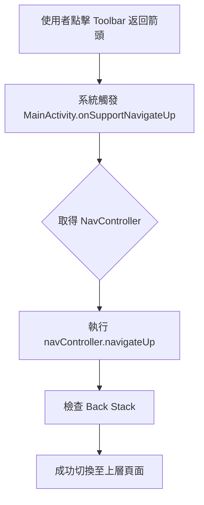
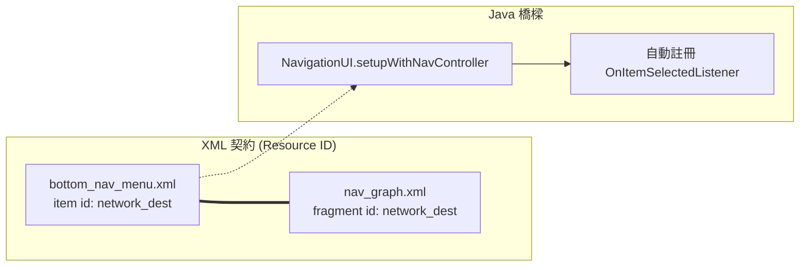
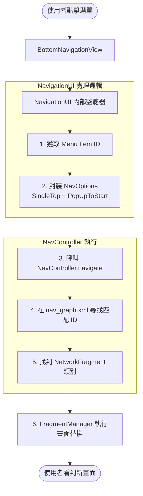

# Android Jetpack Navigation 機制筆記

本文件記錄了專案中關於 Navigation 元件、Toolbar 導航以及 BottomNavigationView 互動的底層運作邏輯。

---

## 1. onSupportNavigateUp 的觸發流程

在 `MainActivity` 中重寫此方法是為了將系統的「向上」導航行為與導航圖（NavGraph）串接。

### 邏輯流向圖

---

## 2. BottomNavigationView 與 NavGraph 的連結機制

這是專案中最核心的自動化導航部分，依賴於 **ID 契約**。

### 自動化連結原理圖

---

## 3. 選單點擊後的執行細節 (onNavDestinationSelected)

當使用者點擊底部選單時，系統如何根據 ID 找到對應的 Fragment 並切換。

### 執行流程圖

---
## 💡 重點總結

1.  **為什麼要重寫 onSupportNavigateUp？**
    如果不重寫，Toolbar 的返回箭頭將沒有反應。重寫後，點擊箭頭就會像執行 `onBackPressed()` 一樣，但會遵循導航圖定義的邏輯。

2.  **為什麼 ID 必須一致？**
    `NavigationUI` 本質上是一個「轉換器」。它看到 Menu ID 是 `network_dest`，就會直接告訴 NavController：「去導航到 ID 為 `network_dest` 的地方」。如果兩邊 ID 不同，這個鏈條就會斷掉。

3.  **setupWithNavController 做了什麼？**
    它幫你寫好了「點擊選單就導航」以及「頁面切換就選中對應選單」這兩組程式碼，達成 **雙向同步**。

---
*建立日期：2026-08-27*
